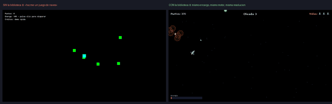
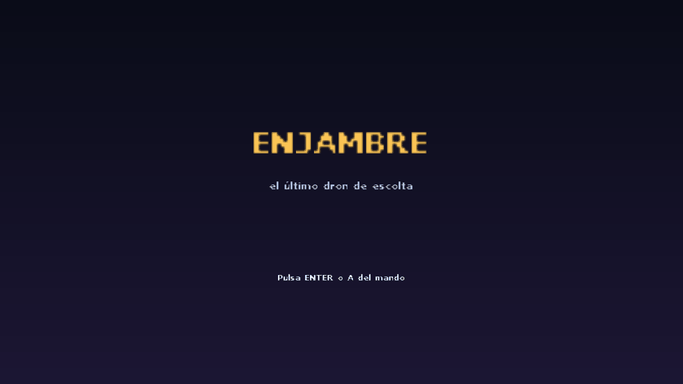
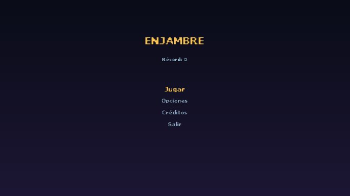
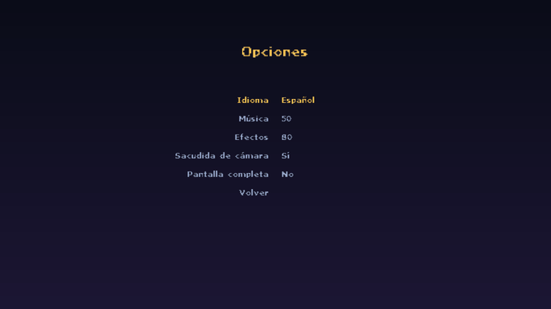
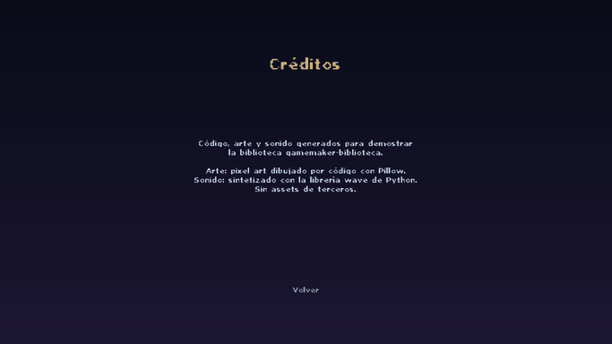
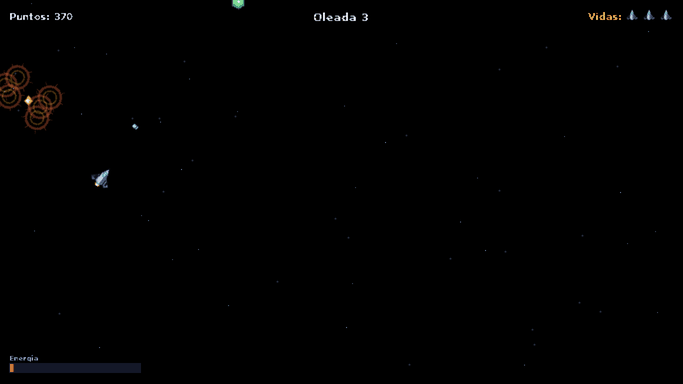
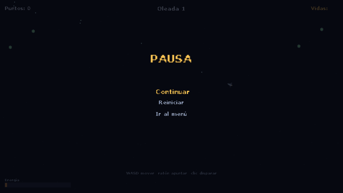
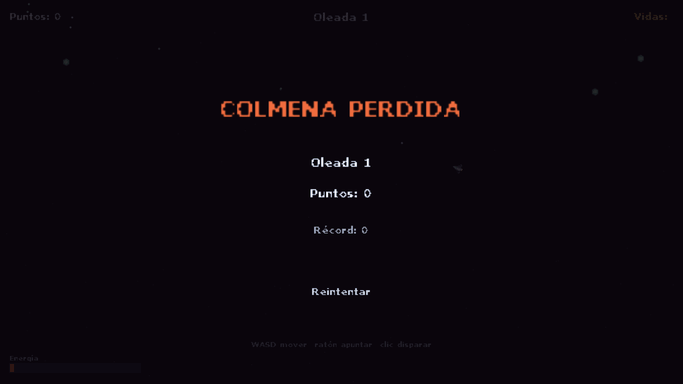
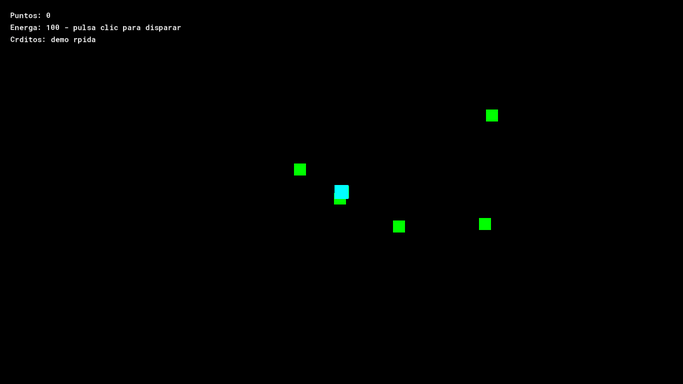

# r18 · La primera prueba que se EJECUTA y se MIRA: «Enjambre», y siete defectos que solo salen así

> **Encargo, literal**: «asegura que todo el proyecto y la skill esté realmente completa y sin
> errores y que con pruebas reales y visuales confirmes que funciona haciendo un juego por
> ejemplo mucho mejor que de lo que se generaría sin la skill».
>
> **Fecha**: 2026-09-09 · **Herramientas**: `gm-cli` 2.3.0 · `ResourceTool@2026.0.17` ·
> runtime GMS2 2026.0.0.23 · macOS arm64 · Pillow 12.2.
>
> **Lo que cambia respecto a las diecisiete pruebas anteriores**: en todas ellas `gm-cli run`
> estaba prohibido — ningún juego se había ejecutado nunca. Aquí el juego **se ejecuta**, se
> **fotografía solo** y las capturas **se miran**. Es la diferencia entre creer que algo
> funciona y saberlo.

---

## 1 · Qué se construyó

**«Enjambre»**, arena de disparo cenital de doble palanca, en `~/enjambre/`:

- **Especificación escrita ANTES del proyecto** (`ESPECIFICACION.md`), con las ocho preguntas
  de `13 · 28` y cada valor asumido marcado `[DEFAULT]`, porque el encargo llegó sin canal de
  vuelta.
- **El arco completo de `04 · 00`**: portada saltable, menú, opciones (idioma, música, efectos,
  sacudida, pantalla completa), créditos, juego, pausa que congela el mundo de verdad, derrota
  con récord, y guardado con versión de esquema y suma de comprobación.
- **Arte propio generado por código**: 30 PNG de pixel art con Pillow sobre una paleta cerrada
  de 16 colores — nave con tres fotogramas de propulsión, tres siluetas de enemigo distintas,
  seis fotogramas de explosión, celdas de energía y estrellas. **Ni un rectángulo de color.**
- **Sonido propio sintetizado**: ocho WAV generados con el módulo `wave` de Python — disparo,
  impacto, estallido, recogida, daño, oleada, clic y un bucle de música de 8 s. Ninguno mudo
  (pico medido entre 11 375 y 32 767).
- **Fuente propia con tildes**, por `font_add_sprite_ext` sobre una hoja de 89 glifos.
- Español e inglés completos, teclado **y** mando.

`validar-proyecto.py`: **555 llamadas analizadas, ninguna función inventada, ninguna aridad
mal**. `gm-cli compile`: exit 0. `auditar-juego-completo.py`: **exit 0**, con las nueve piezas
del envoltorio presentes.

---

## 2 · Los siete defectos que solo aparecieron al EJECUTAR y MIRAR

Ninguno de los siete lo detecta el compilador, ni `validar-proyecto.py`, ni leer el código.

| # | Defecto | Cómo se vio | Estado |
|---|---|---|---|
| 1 | **Las tildes desaparecían**: «Récord» se dibujaba «Rcord», «Créditos» «Crditos», «Energía» «Energa» | En la primera captura, leyéndola | Arreglado con la tercera salida de la Trampa 12: fuente de sprite propia |
| 2 | **El marcador de vidas salía vacío**: el carácter `▮` tampoco está en la hoja de glifos | En la captura del juego | Arreglado dibujando las vidas con el sprite de la nave |
| 3 | **Todo se veía diminuto**: sala de 1366×768 con naves de 24 px | Mirando la captura: «se ven motas de color» | Arreglado con cámara a escala 2 (sala 683×384) |
| 4 | **La pausa no aparecía en la foto**: ESC significa a la vez «pausa» y «atrás» | La captura de pausa era idéntica a la de juego | La prueba pasó a pulsar `P` |
| 5 | **`keyboard_key_release()` genera un SEGUNDO borde de pulsación** | Medido: con release, dos eventos; sin release, uno | Documentado como trampa nueva |
| 6 | **`obj_juego` salía como «rectángulo de color»** siendo el HUD | En el informe del auditor | Arreglado en el auditor con una regla estructural |
| 7 | **La nave no se leía**: alas perdidas, silueta de gota | Mirando la hoja de contactos del arte antes de importarlo | Rediseñada con alas anchas |

**Y tres fallos de la propia prueba**, que merecen estar aquí porque son la clase de error que
hace que una prueba visual mienta:

- La primera versión del capturador buscaba «un proceso llamado Mac_Runner» y lo mataba con
  `pkill`. En una máquina con otro juego abierto, **capturó la ventana equivocada y mató un
  runner ajeno**. Ahora solo puede tocar la rama de procesos que él mismo lanza.
- Encadenar siete capturas en una ejecución producía archivos con el nombre de una pantalla y
  el contenido de otra: `screen_save()` no escribe necesariamente el fotograma en el que se
  llama. Ahora es **una ejecución por pantalla**.
- Un desfase de uno en el índice del guion hacía que la primera tecla **no se pulsara nunca**.
  El síntoma era una captura de menú con nombre de juego, y parecía un fallo del capturador.

---

## 3 · La comparación



Mismo encargo, mismo motor, misma resolución, mismo método de captura y el mismo instante
relativo. A la izquierda, lo que sale de «hazme un juego de naves» tirando de memoria:
cuadrados verdes como enemigos, un cuadrado cian como jugador, «Energa» y «Crditos» sin sus
tildes, y ninguna pantalla que no sea el bucle de juego. A la derecha, el mismo juego con la
biblioteca delante.

| | Sin la biblioteca | Con la biblioteca |
|---|---|---|
| Especificación previa | no existe | 8 preguntas, defaults marcados |
| Arte | `draw_rectangle` | 30 PNG de pixel art propios |
| Sonido | ninguno | 8 WAV sintetizados |
| Tildes | se pierden en silencio | fuente de sprite con 89 glifos |
| Pantallas | 1 (el juego) | 7 (el arco de `04 · 00`) |
| Guardado | no hay | versión de esquema + checksum |
| Idiomas | español a pelo en `draw_text` | es/en conmutables |
| Mando | no | sí |
| Fugas de recursos | dos `ds_list` creadas y nunca destruidas | el auditor lo comprueba |

La fila de las fugas no es retórica: la versión sin biblioteca crea dos `ds_list` en el Create
y no las destruye en ninguna parte — exactamente lo que ahora caza
`auditar-juego-completo.py`, y exactamente lo que no ve el compilador.

---

## 4 · Las siete pantallas, tal como salieron del juego

| | |
|---|---|
|  |  |
|  |  |
|  |  |
|  |  |

La captura del juego enseña **oleada 3 con 370 puntos y las tres vidas intactas**: el piloto
automático del modo captura se comió dos oleadas enteras. Eso no demuestra que el juego sea
bueno —eso lo dice una persona jugando— pero sí que **se juega**: las oleadas avanzan, los
enemigos mueren, las explosiones salen, las celdas caen y el marcador sube.

---

## 5 · Cómo reproducirlo

```bash
python3 herramientas/generar_arte.py arte          # 30 PNG
python3 herramientas/generar_sonido.py sonido      # 8 WAV
python3 herramientas/registrar.py .                # sprites y sonidos al .yyp
python3 herramientas/crear_objetos.py .            # objetos, eventos y salas
gm-cli compile                                     # exit 0
echo "05_juego" > "$HOME/Library/Application Support/com.yoyogames.macyoyorunner/modo_captura.txt"
gm-cli run                                         # se captura y se cierra solo
```

El modo captura vive detrás de un archivo marcador que ningún jugador va a tener, y recorre las
pantallas **pulsando teclas de verdad** (`keyboard_key_press`), no tocando variables por detrás:
lo que se fotografía es el mismo camino que recorre una persona.

---

## 6 · Lo que esta prueba NO demuestra

- **Que el juego sea divertido.** Eso lo dice alguien jugando, y nadie lo ha jugado con las
  manos. Lo que está demostrado es que arranca, se navega, se juega y se cierra.
- **Que funcione en Windows o Linux.** Todo lo de aquí es macOS arm64.
- **Que el arte sea bueno.** Es mejor que un rectángulo, que es el listón que la skill pone.
  No compite con un artista.
